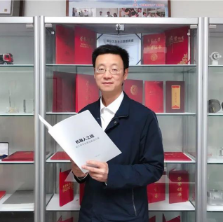
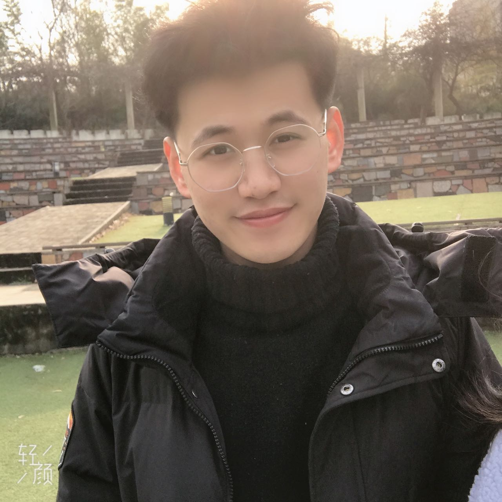

# 🔥 Group Members
<!-- # 🔥 News✒️ -->

## Long-term Enrollment
- If you have solid mathematical foundation and strong programming ability. Welcome to contact me. I hope you are interseted in Machine Learning and Deep Learning Theory, love coding, practical, enthusiastic, have certain psychological ability to resist pressure, have a sense of self-motivation, long-term career planning, and Interested in long-term development in the field of Machine Learning and Artificial Intelligence.

- E-mail：leizhang AT njnu DOT edu DOT cn

------
## Research Partners

 <a href="https://sites.google.com/site/hejunzz/">Jun He</a>

 <a href="http://www.ise.ynu.edu.cn/teacher/805">Hao Wu</a>

 <a href="https://scholar.google.com/citations?hl=zh-CN&user=RjQ5TrEAAAAJ">Aiguo Song</a>

 <a href="https://scholar.google.com/citations?user=QXiEicQAAAAJ">Ming Zeng</a>

------
## Students
### 2023
- On the way...

### 2022

 <a href="https://leizhangnjnu.github.io//alumni/">Songmin Su</a>

 <a href="https://leizhangnjnu.github.io//alumni/">Nanfu Ye</a>

 <a href="https://leizhangnjnu.github.io//alumni/">Minghui Yao</a>

 <a href="https://leizhangnjnu.github.io//alumni/">Jie Wang</a>

 <a href="https://github.com/guangyuyang001">Jianglai Yu</a>

 <a href="https://github.com/small-volcano">Jinpeng Wei</a>

 <a href="https://cheng-haha.github.io/">Shuangteng Song</a>

 <a href="https://leizhangnjnu.github.io//alumni/">Di Xiong</a>

 <a href="https://leizhangnjnu.github.io//alumni/">Yilong Cao</a>

 <a href="https://leizhangnjnu.github.io//alumni/">Quanbin Wang</a>

### 2021

 <a href="https://leizhangnjnu.github.io//alumni/">Yufeng Zhan</a>

 <a href="https://leizhangnjnu.github.io//alumni/">Junjie liang</a>

 <a href="https://leizhangnjnu.github.io//alumni/">Shuaishuai Wang</a>

 <a href="https://leizhangnjnu.github.io//alumni/">Lutong Qin</a>

 <a href="https://github.com/guangyuyang001">Guangyu Yang</a>

 <a href="https://github.com/small-volcano">Can Bu</a>

 <a href="https://cheng-haha.github.io/">Dongzhou Cheng</a>

 <a href="https://leizhangnjnu.github.io//alumni/">Ting Xiong</a>

------
## Alumini
### 2020
- Chaolei Han: Ph.D. Candidate in Southeast University
- Shige Xu: SHEIN
- Xing Wang: Phoenix Contact
- Peitian Chen: Shanghai Municipal Tax Service

### 2019
- Yin Tang: Ph.D. Candidate in Central South University
- Wenbo Huang: Ph.D. Candidate in Southeast University
- Tianyi Liu: Ph.D. Candidate in Southeast University
- Wenbin Gao: Xiaomi
- Xin Cheng: State Grid of China(Shandong)
- Weiming Quan: State Grid of China(Anhui)

### 2018
- Qi Teng: Ph.D. Candidate in Nanjing University
- Kun Wang: Ph.D. Candidate in Southeast University
- Zhenyu Wang: Ph.D. Candidate in Nanjing University
- Jinwei Mao: NARI Group

### 2017
- Zhihao Zhang: NARI Group

### Undergraduate
- Zhixiang Wang: Ph.D. in University of Tokyo
- Shuoyuan Wang: Ph.D. Candidate in University of Macau