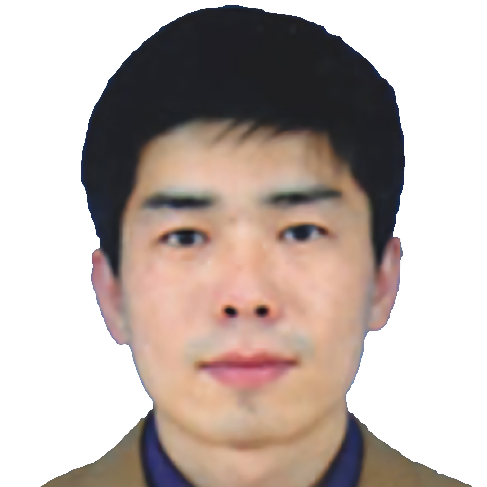
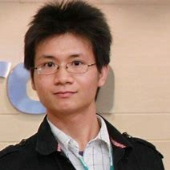

# 👪 Group Members
<!-- # 🔥 News✒️  (-->

## Long-term Enrollment
- I mainly study how to design advanced machine learning algorithms using mathematical tools, which can be further applied to computer vision, data mining, and other related fields. I prefer the students who have solid mathematical foundations, strong programming skills, and good English abilities. The experiences in research (e.g. academic competition, publications, extracurricular academic activities, etc.) will be a benefit. I will provide you a full range of effective guidance in algorithm design, coding, experimental verification, paper writing, presentation, etc.

- E-mail：leizhang AT njnu DOT edu DOT cn

------
## Research Partners

 <a href="https://sites.google.com/site/hejunzz/">Jun He</a>

 <a href="http://www.ise.ynu.edu.cn/teacher/805">Hao Wu</a>

 <a href="https://scholar.google.com/citations?hl=zh-CN&user=RjQ5TrEAAAAJ">Aiguo Song</a>

 <a href="https://scholar.google.com/citations?user=QXiEicQAAAAJ">Ming Zeng</a>

------
## Students
### 2023
- On the way...

### 2022

 <a href="https://leizhangnjnu.github.io//alumni/">Songmin Su</a>

 <a href="https://leizhangnjnu.github.io//alumni/">Nanfu Ye</a>

 <a href="https://leizhangnjnu.github.io//alumni/">Minghui Yao</a>

 <a href="https://leizhangnjnu.github.io//alumni/">Jie Wang</a>

 <a href="https://github.com/guangyuyang001">Jianglai Yu</a>

 <a href="https://github.com/small-volcano">Jinpeng Wei</a>

 <a href="https://cheng-haha.github.io/">Shuangteng Song</a>

 <a href="https://leizhangnjnu.github.io//alumni/">Di Xiong</a>

 <a href="https://leizhangnjnu.github.io//alumni/">Yilong Cao</a>

 <a href="https://leizhangnjnu.github.io//alumni/">Quanbin Wang</a>

### 2021

 <a href="https://leizhangnjnu.github.io//alumni/">Yufeng Zhan</a>

 <a href="https://leizhangnjnu.github.io//alumni/">Junjie liang</a>

 <a href="https://leizhangnjnu.github.io//alumni/">Shuaishuai Wang</a>

 <a href="https://leizhangnjnu.github.io//alumni/">Lutong Qin</a>

 <a href="https://github.com/guangyuyang001">Guangyu Yang</a>

 <a href="https://github.com/small-volcano">Can Bu</a>

 <a href="https://cheng-haha.github.io/">Dongzhou Cheng</a>

 <a href="https://leizhangnjnu.github.io//alumni/">Ting Xiong</a>

------
## Alumini
### 2020
- Chaolei Han: 国家奖学金、校级优秀毕业生、校级优秀研究生，Now Ph.D. Candidate in Southeast University，
- Shige Xu: 阿里、字节跳动、腾讯优图，国家奖学金、校级优秀毕业生、校级优秀研究生，Now at SHEIN
- Xing Wang: 中国广核集团、Phoenix Contact
- Peitian Chen: Now at Shanghai Municipal Tax Service

### 2019
- Yin Tang: 国家奖学金、校级优秀毕业生、校级优秀研究生，Now Ph.D. Candidate in Central South University
- Wenbo Huang: 国家奖学金、校级优秀毕业生、校级优秀研究生，Now Ph.D. Candidate in Southeast University
- Tianyi Liu: 小米，Now Ph.D. Candidate in Southeast University
- Wenbin Gao: 中兴、南京银行，Now at Xiaomi
- Xin Cheng: Now at State Grid of China(Shandong)
- Weiming Quan: Now at State Grid of China(Anhui)

### 2018
- Qi Teng: 国家奖学金、校级优秀毕业生、校级优秀研究生，Now Ph.D. Candidate in Nanjing University
- Kun Wang: 国家奖学金、校级优秀毕业生、校级优秀研究生，Now Ph.D. Candidate in Southeast University
- Zhenyu Wang: 网易，Now Ph.D. Candidate in Nanjing University
- Jinwei Mao: Now at NARI Group

### 2017
- Zhihao Zhang: Now at NARI Group

### Undergraduate
- Zhixiang Wang: Ph.D. in University of Tokyo
- Shuoyuan Wang: Now Ph.D. Candidate in University of Macau